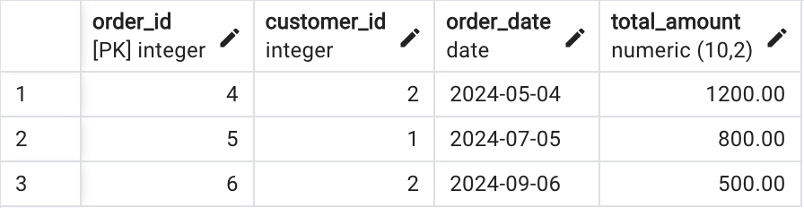
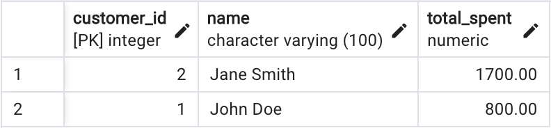
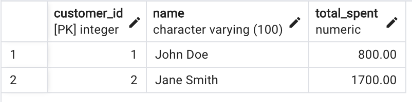
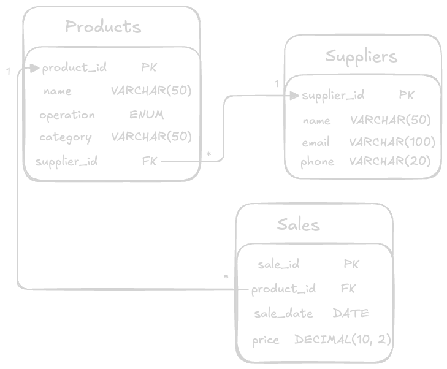

# Data Engineer Technical Test

## Part 1: SQL and Query Optimization

### Exercise 1: Writing Queries

#### Database schema for a sales system:
- **Customers** (customer_id, name, email, phone)
- **Orders** (order_id, customer_id, order_date, total_amount)
- **Order_Details** (order_detail_id, order_id, product_id, quantity, price)
- **Products** (product_id, name, category, price)

#### Instructions:
1. Write an SQL query to obtain the total amount spent by each customer in the last 6 months. The query should return: `customer_id`, `name`, `total_spent`.
2. Optimize the above query to ensure it is efficient, considering indexes and other optimization techniques.

#### Delivery:
- Include the SQL script for the initial query and the optimized version.
- Briefly explain the optimizations you made and why.

---

### Solution for Exercise 1

The SQL script for the initial query is as follows (`first_solution.sql`):
```sql
SELECT c.customer_id, c.name, SUM(o.total_amount) AS total_spent
FROM customers c
JOIN orders o ON c.customer_id = o.customer_id
WHERE o.order_date >= (NOW() - INTERVAL '6 months')
GROUP BY c.customer_id
ORDER BY total_spent DESC;
```
In the above query, we are joining the `customers` and `orders` tables and filtering the orders placed in the last 6 months. We then group the results by `customer_id` and calculate the total amount spent by each customer, sorting the results by total amount spent in descending order to see the highest spenders first (although this is not necessary).

The orders of the last 6 months (`show_order_last_six_months.sql`):



The result of the initial query:



Time taken to execute the initial query: **64ms**


To optimize the query, we can consider the following:
- **Indexing**: This can improve the query performance significantly for JOIN operations and WHERE conditions.
- **Use session variables**: We can use session variables to avoid calculating the same value multiple times.
- **Remove unnecessary operations**: Removing DESC sorting can improve performance.

The optimized version of the query is as follows (`solution_optimized.sql`):
```sql
CREATE INDEX idx_orders_customer_id ON Orders (customer_id);
CREATE INDEX idx_orders_order_date ON Orders (order_date);

WITH params AS (
    SELECT NOW() - INTERVAL '6 months' AS date_limit
)
SELECT c.customer_id, c.name, SUM(o.total_amount) AS total_spent
FROM customers c
JOIN orders o ON c.customer_id = o.customer_id
JOIN params p ON o.order_date >= p.date_limit
GROUP BY c.customer_id;
```

The result of the optimized query:



Time taken to execute the optimized query: **46ms**


### Exercise 2: SQL Query Optimization

You are given the following SQL query, which is taking too long to execute:

```sql
SELECT
    p.category,
    SUM(od.quantity * od.price) AS total_sales
FROM
    Products p
JOIN
    Order_Details od ON p.product_id = od.product_id
JOIN
    Orders o ON od.order_id = o.order_id
WHERE
    o.order_date >= '2024-01-01'
GROUP BY
    p.category;
```
#### Instructions:
- Optimize the above query.
- Describe the modifications you made and justify why they improve performance.

#### Delivery:
- Include the optimized SQL script.
- Explain the applied improvements.

---

### Solution for Exercise 2

The provided SQL query is slow, taking **93ms** to execute.


Following the same approach as in **Exercise 1**, we can optimize the query by creating appropriate indexes:

- **`product_id`** on `Order_Details` to improve the `JOIN` with `Products`.
- **`order_id`** on `Order_Details` to optimize the `JOIN` with `Orders`.
- **`order_date`** on `Orders` to accelerate the date filter.

```sql
CREATE INDEX idx_order_details_product_id ON Order_Details (product_id);
CREATE INDEX idx_order_details_order_id ON Order_Details (order_id);
CREATE INDEX idx_orders_order_date ON Orders (order_date);
```

These indexes reduce the need for full table scans, improving lookup times and speeding up JOIN operations.

The full optimized query is in `optimized_query.sql`.

The optimized query execution time was reduced to **46ms**, as shown below:


## Part 2: Data Modeling

### Exercise 3: Data Modeling

We provide the following descriptions of the entities in an inventory management system:

1. **Products**: Items that can be bought or sold, including details such as price, category, and supplier.
2. **Suppliers**: Entities that provide products.
3. **Sales**: Transactions where products are sold to customers.

#### Instructions:
1. Design a data model that captures these entities and their relationships.
2. Explain whether you would use a 3NF, star, or snowflake modeling approach, and justify your choice.

#### Delivery:
- A diagram of the data model (it can be a simple drawing or a digital representation).
- A brief explanation of the chosen modeling approach.

---

### Solution for Exercise 3

The data model for the inventory management system is designed as follows:



The data model consists of three entities: `Products`, `Suppliers` and `Sales`.

- The `Products` entity contains details about the items available for sale, such as `product_id`, `name`, `operation` (an `ENUM`, can be `sold` or `bought`), `category` (a VARCHAR because we don't now all the existent categories) and `supplier_id` (a foreign key to the `Suppliers` entity).
- The `Suppliers` entity contains information about the entities that provide products, such as `supplier_id`, `name`, `email` and `phone`.
- The `Sales` entity represents transactions where products are sold to customers. It contains details such as `sale_id`, `product_id` (a foreign key to the `Products` entity), `sale_date` and `price`.

The relationships between these entities are as follows:

- Each `Product` can have multiple `Sales` and `Sale` can have one `Product`.
- Each `Product` can have one `Supplier` and one `Supplier` can supply multiple `Products`.

The modeling approach chosen is a **3NF (Third Normal Form)** model because it reduces data redundancy and ensures data integrity, making it perfect for transactional systems such as this one. The other two approaches are more suitable for data warehousing and business intelligence systems.

## Part 3: DBT (Data Build Tool)

### Exercise 4: Creating DBT Models

Assume you have a database with the following tables: `raw_customers`, `raw_orders`, `raw_order_details`.

#### Instructions:
1. Create a DBT model that:
    - Normalizes the data from `raw_customers`.
    - Calculates total sales per customer using `raw_orders` and `raw_order_details`.
2. Describe how you would implement tests (unit tests) to ensure the quality of the data in these models.

#### Delivery:
- Include the relevant `.sql` and `.yml` files for DBT.
- Explain the testing process and any relevant configurations.

---

### Solution for Exercise 4

Using the same `sales` db from  **Part 1**, I have initialized a new DBT project using Python:

```bash
python -m venv venv
source venv/bin/activate
pip install -r requirements.txt
dbt init
```

This create a `profiles.yml` file in the `.dbt` directory with the following content:

```yml
my_dbt_profile:
  outputs:
    dev:
      dbname: sales
      host: localhost
      pass: postgres
      port: 5432
      schema: orders
      threads: 1
      type: postgres
      user: postgres
  target: dev
```

I have created the following models:

- `customers.sql`: Normalizes the data from `raw_customers`.
- `costumer_sales.sql`: Calculates total sales per customer using `raw_orders` and `raw_order_details`.

The tests are implemented in the `schema.yml` file:

```yml
version: 2

sources:
  - name: raw
    database: sales
    schema: public
    tables:
      - name: customers
      - name: orders
      - name: products
      - name: order_details

models:
  - name: customers
    columns:
      - name: customer_id
        tests:
          - unique
          - not_null
      - name: email
        tests:
          - unique
          - not_null

  - name: customer_sales
    columns:
      - name: customer_id
        tests:
          - unique
          - not_null
          - relationships:
              to: ref('customers')
              field: customer_id
      - name: total_sales
        tests:
          - not_null
```

The tests ensure that the `customer_id` and `email` columns in the `customers` table are unique and not null. The `customer_id` column in the `customer_sales` table is unique, not null and has a relationship with the `customer_id` column in the `customers` table. The `total_sales` column in the `customer_sales` table is not null.

To run the tests, use the following command:

```bash
dbt clean && dbt compile && dbt run && dbt test
```

## Tools Used

- **Database**: PostgreSQL
- PgAdmin 4
- **DBT**: Data Build Tool
- Python
